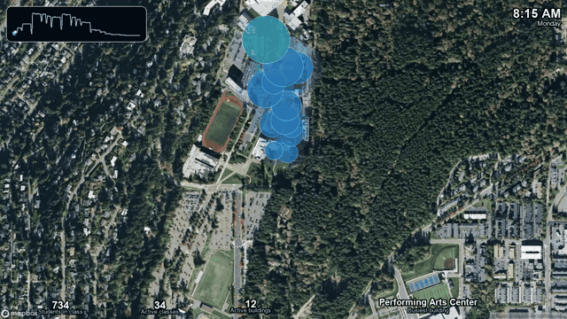

# WWU Traffic Report

An interactive Streamlit map of scheduled classroom occupancy across Western Washington University's main campus. Use the weekday and time sliders to explore where students are expected to be during a typical Spring 2026 school day.

## Demo

[](https://www.youtube.com/watch?v=Kktm-zQIgNw)

- [Watch the video walkthrough](https://www.youtube.com/watch?v=Kktm-zQIgNw)
- [Open the live Streamlit app](https://wwu-daily-traffic.streamlit.app/)

## Run Locally

Create `.streamlit/secrets.toml` with a Mapbox token:

```toml
MAPBOX_TOKEN = "your-mapbox-token"
```

Then install the dependencies and launch the app:

```bash
pip install -r requirements.txt
streamlit run streamlit_app.py
```
